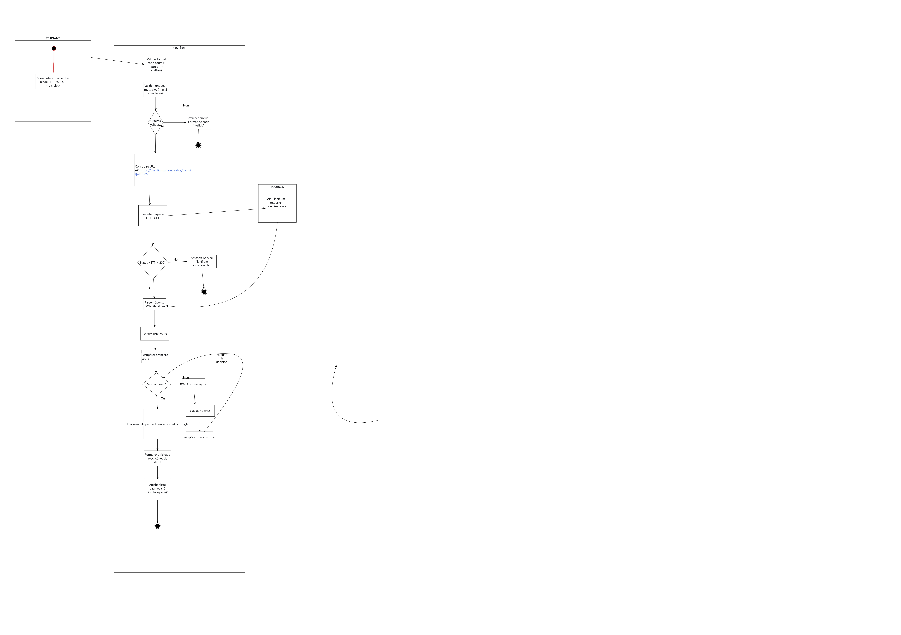
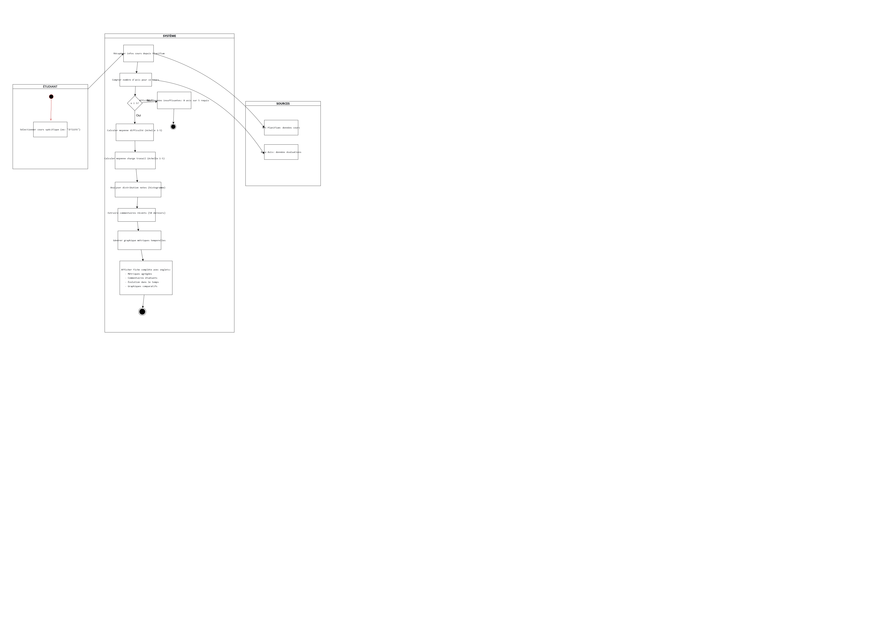
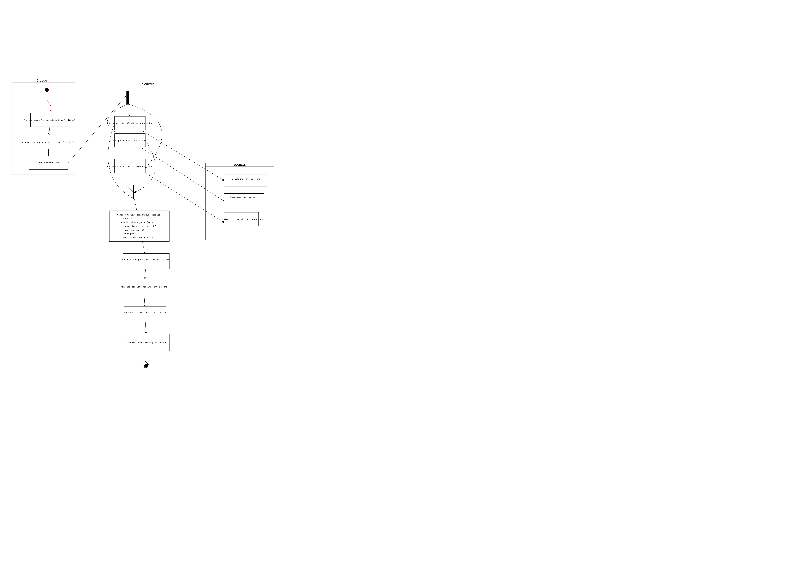
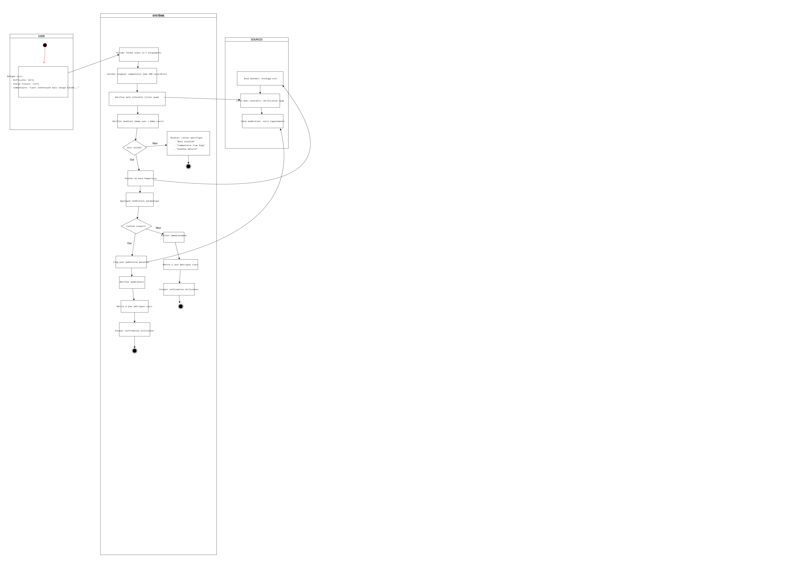
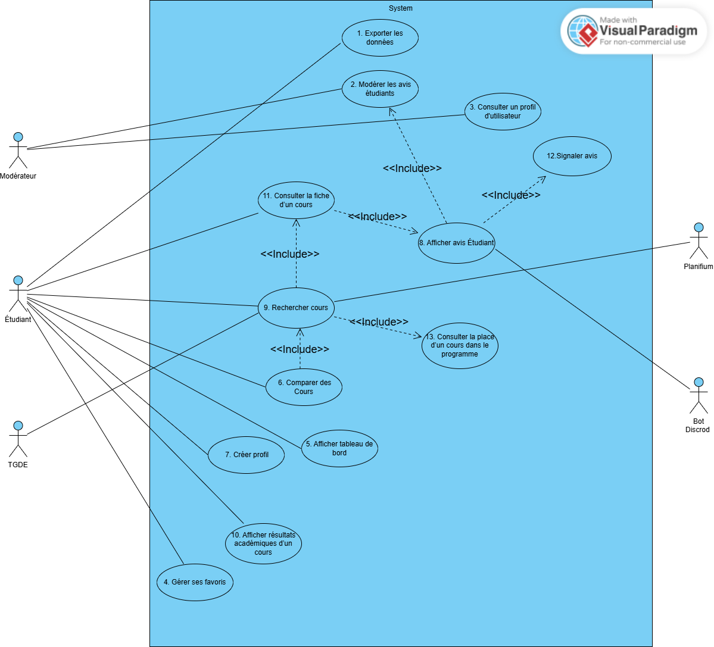
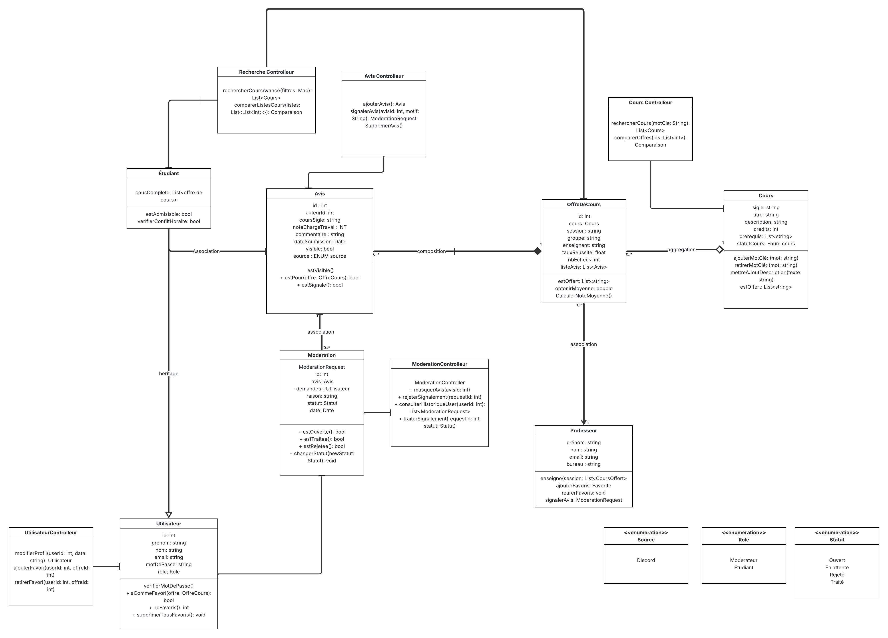

# Flux principaux

## Objectif

Cette section présente les principaux diagrammes du projet, incluant les diagrammes de cas d’utilisation, d'activité et le modèle C4. Ils illustrent la structure globale du système, les interactions entre les acteurs et les composants, ainsi que la dynamique des scénarios clés.

## Diagrammes

### Recherche de cours (CU09)

### Consultation fiche de cours (CU11)  

### Comparaison de cours (CU06)

### Soumission d'avis (Phase 2)

**Modèle C4**

**Diagramme des cas d'utilisation**

**Diagramme des classes**
